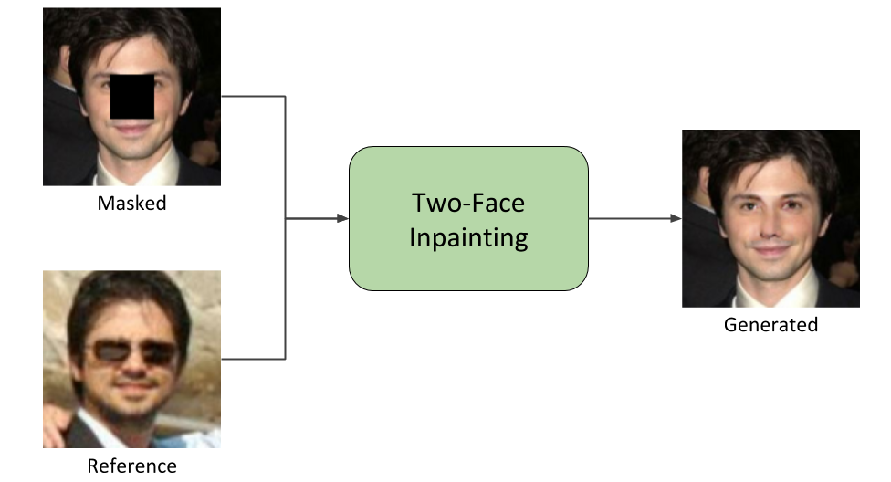

# Two-Face Inpainting
Two-Face Inpainting consists of a Machine Learning model that uses Generative Adversarial Networks for reconstructing missing regions of facial images. The model takes as input the masked image and a reference image from the same person (thus the name Two-Face Inpainting), and generates the missing region on the masked image. The project also has a [Web Application](https://github.com/gsnaider/two-face-web-client) for testing the model with any facial image.<br/>
Two-Face Inpainting was implemented as the final project for my Software Engineering degree at the University of Buenos Aires.



[//]: # (//TODO add license.)
[//]: # (//TODO maybe add Architecture description with image.)

## Index  
- [Documentation](#documentation)
- [Deployment](#deployment)
    * [Pre-requisites](#deploy-pre-requisites)
        + [Docker](#docker)
        + [TensorFlow Serving](#tf-serving)
        + [Saved Model](#saved-model)
    * [Launch the model](#launch)
- [Run from sources](#run-from-sources)
    * [Pre-requisites](#run-pre-requisites)
        + [Python 3](#python-3)
        + [TensorFlow](#tensorflow)
        + [Python libraries](#python-libraries)
        + [Google Cloud Platform](#gcp)
    	+ [Dataset setup](#dataset)
    	+ [FaceNet](#facenet)
    * [Run modes](#run-modes)
	    + [Train](#train)
	    + [Evaluation](#eval)
	    + [Save model](#save-model)


<a name="documentation"/>

## Documentation
[//]: # (//TODO host the pdf in github pages.)
The full documentation of the project can be found [here](https://github.com/gsnaider/two-face-inpainting/blob/master/doc/Two-Face%20Inpainting.pdf) (in spanish).

<a name="deployment"/>

## Deployment
The following section specifies how to deploy the model locally using TensorFlow Serving, and test it through a REST API.
<a name="deploy-pre-requisites"/>

### Pre-requisites
These are the pre-requisites for deploying the model with TensorFlow Serving.

<a name="docker"/>

#### Docker
[Docker](https://www.docker.com/) is required for running the TensorFlow Serving container. In order to install it, follow the instructions from: https://docs.docker.com/install/

<a name="tf-serving"/>

#### TensorFlow Serving
[TensorFlow Serving](https://www.tensorflow.org/serving) will be used for deploying the model. After installing Docker, simply run the following:
```sh
docker pull tensorflow/serving
```
This will pull down a minimal Docker image with TensorFlow Serving installed.

<a name="saved-model"/>

#### Saved Model
The saved model is provided in the release v1.1, in the `saved_model.tar.xz` file. You will have to extract that directory, and you can move the contents of that directory to any location you want on your computer. From now on we will refer to that location as `<saved_model_dir>`.

<a name="launch"/>

### Launch the model
Before launching the model, make sure the `MODEL_DIR` variable in the `tf-serving/start-docker.sh` script points to the  `<saved_model_dir>` from the previous step.
In order to launch the model, simply run:
```sh
sudo ./tf-serving/start-docker.sh
```
It might take a couple of minutes for the server to start.<br/>
Once the server's initialized, we can make requests via the REST API provided by TensorFlow Serving. For making a sample request, you can use the provided sample file and script:

```sh
sudo ./tf-serving/sample-request.sh
```

For stopping the server, simply run:

```sh
sudo ./tf-serving/stop-docker.sh
```

<a name="run-from-sources"/>

## Run from sources
This section describes the basic steps in order to run the model from the source files. This allows to run the train and eval scripts, as well as save trained models.

<a name="run-pre-requisites"/>

### Pre-requisites
These are the pre-requisites for running the model from sources.

<a name="python-3"/>

#### Python 3
Check that you have python3 along with pip3 and virtualenv:

```sh
python3 --version
pip3 --version
virtualenv --version
```
If these packages are not installed, install them running the following:
```sh
sudo apt update
sudo apt install python3-dev python3-pip
sudo pip3 install -U virtualenv  # system-wide install
```

<a name="tensorflow"/>

#### TensorFlow
The whole model is implemented in [TensorFlow](https://www.tensorflow.org/) 1.12. For installing, follow the instructions on https://www.tensorflow.org/install. It is recommended to install TensorFlow (and the libraries below) in a new virtual environment (as described in TensorFlow installation guide).

<a name="python-libraries"/>

#### Python libraries
In addition to installing TensorFlow, the libraries from `src/setup.py` need to be installed in the virtual environment. You can install them with pip by running:

```sh
pip install matplotlib==2.2.2
pip install scikit-image==0.14.1
pip install h5py==2.8.0 
pip install fs==2.1.2 
pip install fs-gcsfs==0.3.0
```

<a name="gcp"/>

#### Google Cloud Platform

In order to run the model, we use the Google Cloud Platform SDK. This makes it easy to run training jobs both locally and on the cloud with very little differences in setup. In order to install it, you can follow the instructions in https://cloud.google.com/sdk/install. Note that you will also have to set up an account in [Google Cloud Platform](https://cloud.google.com/) and create a project. Alternatively, you could run the `src/trainer/task.py` as a regular python script without using Google Cloud Platform, but the scripts provided for running the model use the GCP SDK. If you want to manually run it directly with python, you will have to make sure all the proper flags are passed to the script, and remove the ones from GCP.

<a name="dataset"/>

#### Dataset setup
The dataset used for training the model is [CASIA WebFace](https://arxiv.org/abs/1411.7923). In order to run the model locally, the dataset needs to be split in the following structure:

```
data
├── data.zip
├── masked-files.txt
├── real-files.txt
├── reference-files.txt
├── train
│   ├── masked
│   │   ├── 0257343
│   │   │   ├── 001.jpg
│   │   │   ├── 002.jpg
│   │   │   ├── 003.jpg
│   │   │   └── 004.jpg
│   │   ├── 0257598
│   │   ├── 0257821
│   |   ...
│   │   └── 0257969
│   ├── real
│   │   ├── 0257343
│   │   │   ├── 005.jpg
│   │   │   ├── 006.jpg
│   │   │   ├── 007.jpg
│   │   │   └── 008.jpg
│   │   ├── 0257598
│   │   ├── 0257821
│   |   ...
│   │   └── 0257969
│   └── reference
│       ├── 0257343
│       │   ├── 009.jpg
│       │   ├── 010.jpg
│       │   ├── 011.jpg
│       │   └── 012.jpg
│       ├── 0257598
│       ├── 0257821
│       ...
│       └── 0257969
└── validation
    ├── masked
    ├── real
    └── reference
```
From now on we will refer to the root directory of the dataset as `<dataset_dir>`.
The data is splitted between a `train` and `validation` directories (a test directory was kept separate for final testing using the Web Application). Within each directory, the data is also splitted into three sub-directories: `masked`, `real`, and `reference`. The `masked` directory contains the images that will be masked during training (i.e. a region of the image will be removed in order to be filled by the model). The `referenece` directory contains images from the same persons as in `masked`. Those images will be used as reference by the model when completing the masked images. Lastly, the `real` directory contains images that won't be modified by the model. Instead, those images are used for training the Discriminators from the GAN architecture (since Discriminators need both real and generated images for training). Note that the three sub-directories (masked, real, and reference) within each dataset (train and validation) have the same set of identities (persons).<br/>
In order to efficiently read through the dataset, the model uses the `.txt` files shown above. The `masked-files.txt` and `real-files.txt` have a unique name for each image in their respective datasets. The `reference-files.txt` specifies for each identity, the possible images to use as reference (so that the model can pick one at random).
The scripts provided in the `dataset-files` directory from the repository can be used for structuring the dataset in this way.<br/>
The `<dataset_dir>` also contains a `data.zip` file. This zip contains the same files as in the `<dataset_dir>` (ommiting the `data.zip` file). This can be used for running the model with an in-memory dataset.

<a name="facenet"/>

#### FaceNet

The [FaceNet](https://www.cv-foundation.org/openaccess/content_cvpr_2015/papers/Schroff_FaceNet_A_Unified_2015_CVPR_paper.pdf) pre-trained model is used as part of the architecture. The model is provided in the release 1.1, in the `facenet.tar.xz` file. This model is an adapted version of the one found in https://github.com/serengil/tensorflow-101/blob/master/model, with an input size of 128x128 instead of 160x160. You can extract this directory and move it to any other location. From now on we will refer to the facenet directory as `<facenet_dir>`.


<a name="run-modes"/>

### Run modes

<a name="train"/>

#### Train

In order to run the model in training mode, simply run the `src/run-local.sh` script. Make sure that the `DATASET_PATH` variable points to the `<dataset_dir>`, or to the `data.zip` file within `<dataset_dir>` for running with an in-memory dataset. The `FACENET_DIR` variable should point to the `<facenet_dir>`. The directory specified in `EXPERIMENT_DIR` is where the checkpoints of the experiment will be saved. You can use [TensorBoard](https://www.tensorflow.org/guide/summaries_and_tensorboard) for visualizing the results in the `EXPERIMENT_DIR`.

<a name="eval"/>

#### Evaluation

Running the model in evaluation is similar to the train mode. Simply run the `src/run-local-eval.sh`, while making sure the proper variables are set as described in the [Train](#train) section above.

<a name="save-model"/>

#### Save model

Finally, for saving a trained model, you can use the `src/run-local-save-model.sh` script. This script will take the checkpoints from the `EXPERIMENT_DIR` directory, and use them to create a saved-model in that same directory.